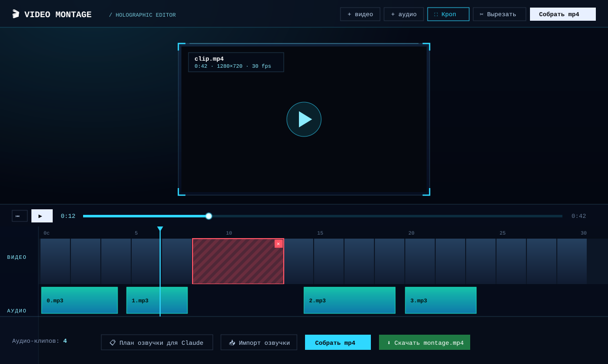

# 🎬 Video Montage

A local, in-browser video editor with a holographic HUD interface. Everything runs
on your machine: video and audio are never uploaded anywhere — they're processed by
a local backend via [ffmpeg](https://ffmpeg.org/).

Built for a simple workflow: **take a video, lay a voiceover on top, and export an
mp4** — with handy [Claude Code](https://claude.com/claude-code) integration that
generates voiceover text straight from the video frames.



## Features

- **Timeline with video frames** — ffmpeg splits the video into preview frames, so
  you can see the whole clip on the track.
- **mp3 voiceover** — drag audio onto the track and move it in time; you can pick a
  whole batch of files at once and they'll be laid out back-to-back.
- **Synced preview with sound** — custom play/pause controls; the video plays
  together with the laid-out voiceover before you even export.
- **Frame crop** — a handled frame over the video trims the edges (works for any
  aspect ratio).
- **Time cuts** — mark the segments you don't need; on export they're cut out and
  the rest is stitched back together, with audio clips shifting automatically.
- **Projects** — everything is saved to disk and survives restarts; autosave.
- **mp4 export** — H.264/AAC + faststart, guaranteed to play everywhere.
- **Claude Code voiceover integration** — a button copies JSON with frames and
  timings; Claude Code looks at the frames and returns voiceover text as
  `{start, end, text}` segments; generate mp3s in any TTS and import them back by
  timing.

## Stack

- **Backend**: Node.js + Express, [ffmpeg-static](https://www.npmjs.com/package/ffmpeg-static)
  / ffprobe-static (binaries installed via npm — no manual ffmpeg needed).
- **Frontend**: React + Vite + TypeScript, a custom HUD design in plain CSS.

## Requirements

- Node.js 18+ (developed on Node 24).
- npm.

You do **not** need to install ffmpeg — it's pulled in by the `ffmpeg-static` package.

## Install & run

```bash
git clone https://github.com/gitmir-hello/video-montage.git
cd video-montage
npm install          # also downloads the ffmpeg binary
npm run dev          # backend :3001 + frontend :5173
```

Open **http://localhost:5173** — create a project, load a video, start working.

Production mode (backend serves the built frontend):

```bash
npm run build
npm start            # http://localhost:3001
```

## How to use

1. **Create a project** and load a video → frames appear on the timeline.
2. **Add voiceover**: drag mp3s onto the audio track or click "+ audio" (a batch
   works too). Move clips in time.
3. **Trim and clean up**: "⛶ Crop" — the frame trims the edges; "✂ Cut" — drag
   across the video track to mark segments for removal.
4. **Preview** — hit ▶: the video plays with sound and skips over cuts.
5. **Export mp4** — the "Export mp4" button, then download the result.

### Voiceover via Claude Code

1. **"📋 Voiceover plan for Claude"** — copies JSON with frames (paths to the
   images) and timings.
2. Paste it into Claude Code — it looks at the frames and returns
   `[{start, end, text}, …]`.
3. Edit the text, generate an mp3 per segment in any TTS, name them `0.mp3`,
   `1.mp3`, …
4. **"📥 Import voiceover"** — paste the same JSON + select the mp3s; file `N.mp3`
   lands at the `start` of segment `[N]`.

## How it works

Projects are stored on disk as self-contained folders:

```
data/projects/<id>/
  project.json     # metadata, audio assets, clip layout, crop, cuts
  video.<ext>      # source video
  frames/          # small preview frames for the timeline
  keyframes/       # large frames for Claude Code analysis
  audio/           # uploaded mp3s
  exports/         # built mp4s
```

Crop is stored in fractions (resolution-independent), cuts in seconds. The final
export is a single ffmpeg call with `filter_complex`: cuts (`trim`+`concat`) → crop
(`crop`) → voiceover mix (`adelay`+`amix`), re-encoded to H.264/AAC.

## License

[GNU GPL-3.0-or-later](LICENSE) © Vladimir Miroshnichenko
